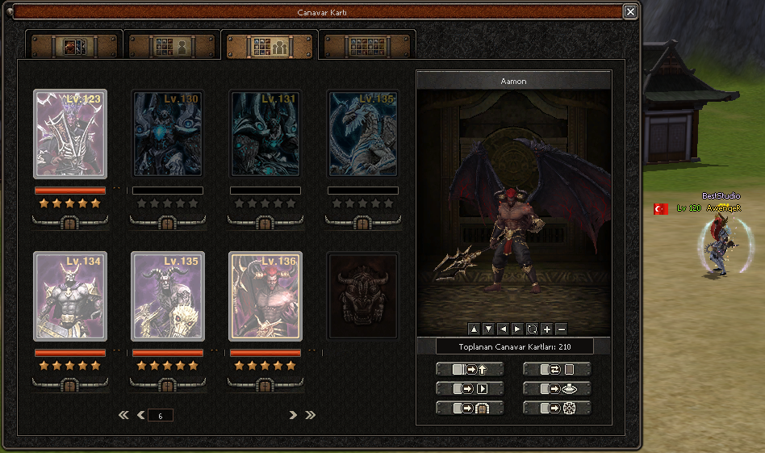

# Official Monster Card System

## Resmi Canavar Kartı Sistemi



Tanıtım videosu: [YouTube](https://youtu.be/LhhbO06cRDw)

Resmi wiki referansı: [Canavar Kart Sistemi](https://tr-wiki.metin2.gameforge.com/index.php/Canavar_Kart_Sistemi)

Bu paket, `ENABLE_MONSTER_CARD` define'ı ile ayrıştırılmış **Resmi Canavar Kartı Sistemi** exportudur. Sistem; oyuncunun belirli canavar kartlarını toplaması, görev hedeflerini tamamlaması, kartları yıldız seviyesine yükseltmesi, canavar modelini pencerede görüntülemesi ve açılan özellikleri kullanması üzerine kuruludur.

Resmi sistem mantığına göre Canavar Kart paneli `J` tuşu veya taskbar butonu ile açılır. İlerleme hesap bazlıdır; yani aynı hesaptaki karakterler sistemi ortak kullanır. Kartlar toplandıkça canavarlar yıldız kazanır ve yıldız seviyesine göre önizleme, hareket görüntüleme, dönüşüm, ışınlanma, çağırma/ek özellik akışları açılır. Bu export içinde başarı/set bonus tarafı da bulunduğu için achievement verileri, bonus tabloları ve ilgili UI dosyaları pakete dahildir.

## Klasör Yapısı

```txt
Official Monster Card System
├─ 01. Svn
│  ├─ Client
│  │  ├─ EterLib
│  │  ├─ EterPythonLib
│  │  └─ UserInterface
│  └─ Server
│     ├─ common
│     └─ game
├─ 02. Client
│  ├─ d
│  │  └─ ymir work/ui
│  ├─ icon
│  ├─ locale
│  │  └─ locale
│  │     ├─ common
│  │     └─ tr
│  ├─ root
│  └─ uiscript
├─ 03. Server
│  ├─ mysql
│  │  ├─ account
│  │  └─ player
│  └─ share
└─ official-monster-card-system.png
```

Paket şu anki güncel haliyle `329` dosyadan oluşuyor.

## Sistem Mimarisi

Server tarafındaki ana sınıf:

```txt
kalisto::MonstercardSystem
```

Bu manager oyuncu hesabına bağlı görev seviyesini, seçilen görev canavarlarını, öldürme ilerlemesini, kart koleksiyonunu, yıldız seviyelerini, özellik bekleme sürelerini ve achievement bonuslarını yönetir.

Client source tarafındaki ana parçalar:

```txt
PythonMonsterCardManager
PythonIllustratedManager
PythonInterfaceModelModule
InterfaceModel
InterfaceModelRenderer
```

Bu parçalar Python UI ile C++ client arasındaki köprüyü, canavar modelinin UI içinde render edilmesini, kamera/rotasyon/zoom kontrollerini ve `player`, `net`, `app` bindinglerini sağlar.

Pack tarafındaki ana pencere:

```txt
02. Client/root/uimonstercard.py
```

Bu dosya görev sayfasını, koleksiyon/solo/party sekmelerini, achievement sayfasını, kart butonlarını, tooltipleri ve `/cardmonster` komut akışını yönetir.

## Define ve Bağlı Sistemler

Zorunlu ana define:

```cpp
#define ENABLE_MONSTER_CARD
```

Client achievement/bonus sekmesi için bu pakette kullanılan ek define:

```cpp
#if defined(ENABLE_MONSTER_CARD)
	#define ENABLE_MONSTER_CARD_ACHIEV
#endif
```

Bu sistemin tam çalışması için sadece define açmak yetmez. Aşağıdaki parçalar da birlikte entegre edilmelidir:

```txt
Client model render altyapısı  -> InterfaceModel, PythonIllustratedManager, EterLib camera/render ekleri
Client Python bindingleri      -> player, net, app, wndMgr tarafındaki Monster Card fonksiyonları
Server manager                 -> MonstercardSystem.cpp / MonstercardSystem.h
Server komut akışı             -> /cardmonster ve MONSTERCARDSYSTEM chat-command dönüşleri
Server kill/drop bağlantısı    -> char_battle.cpp, char_item.cpp, item_manager.cpp
DB kalıcılığı                  -> account.monstercardsystem_level, player.monstercard_* tabloları
Pack verileri                  -> monster_card.txt, monster_card_achiev.txt, monster_card_achiev_desc.txt
UI görselleri                  -> d/ymir work/ui/game/monster_card
```

Kod içinde görünen ama Monster Card için doğrudan zorunlu olmayan uyumluluk define'ları:

```txt
__PARTY_KILL_RENEWAL__       -> Aktifse party kill sayımı bu sisteme uyarlanır.
__CONQUEROR_LEVEL__          -> Level/Conqueror level kontrolü olan forklar için koşullu uyumluluk noktasıdır.
__EXTEND_INVEN_SYSTEM__      -> Geniş envanter kullanan forklar için item kullanım kontrolünde korunmalıdır.
ENABLE_MYSHOP_DECO           -> Client render/model view ortak altyapısında aynı alanı paylaşır.
ENABLE_MINI_GAME_YUTNORI     -> Client render/model view ortak altyapısında aynı alanı paylaşır.
ENABLE_SHARED_PACK_CHANGE_LOCALE_PATH -> common/ui path çözümünde kullanılan locale-pack uyumluluğudur.
ENABLE_FOG_FIX, ENABLE_FOV_OPTION, __RENDER_TARGET_VIEW_PORT_FIX -> Görsel/render davranışını etkileyen opsiyonel client düzeltmeleridir.
```

Özetle: `ENABLE_MONSTER_CARD` sistemin ana kapısıdır. `ENABLE_MONSTER_CARD_ACHIEV` kapatılırsa ana kart sistemi çalışabilir ama başarı/set bonus sekmesi eksik kalır. Model preview tarafını entegre etmezsen pencere açılsa bile canavar görüntüleme, rotasyon ve kamera kontrolleri tam çalışmaz.

## 01. Svn İçeriği

### Server Source

```txt
01. Svn/Server/common/service.h
01. Svn/Server/game/MonstercardSystem.cpp
01. Svn/Server/game/MonstercardSystem.h
01. Svn/Server/game/MonstercardVnums.txt
01. Svn/Server/game/MonstercardCoordinates.txt
01. Svn/Server/game/char.cpp
01. Svn/Server/game/char.h
01. Svn/Server/game/char_battle.cpp
01. Svn/Server/game/char_item.cpp
01. Svn/Server/game/cmd.cpp
01. Svn/Server/game/cmd_general.cpp
01. Svn/Server/game/item_manager.cpp
01. Svn/Server/game/item_manager.h
01. Svn/Server/game/Makefile.md
```

`MonstercardSystem.cpp` şu iki dosyayı compile-time include eder:

```cpp
#include "MonstercardCoordinates.txt"
#include "MonstercardVnums.txt"
```

Bu yüzden `MonstercardCoordinates.txt` ve `MonstercardVnums.txt` dosyaları game source dizininde `MonstercardSystem.cpp` ile aynı seviyede olmalıdır.

### Client Source

```txt
01. Svn/Client/EterLib
01. Svn/Client/EterPythonLib
01. Svn/Client/UserInterface
```

Önemli UserInterface dosyaları:

```txt
PythonMonsterCardManager.cpp / .h
PythonIllustratedManager.cpp / .h
PythonInterfaceModelModule.cpp / .h
InterfaceModel.cpp / .h
InterfaceModelRenderer.h
PythonApplication.cpp / .h
PythonApplicationCamera.cpp
PythonApplicationModule.cpp
PythonNetworkStreamCommand.cpp
PythonNetworkStreamModule.cpp
PythonPlayerModule.cpp
PythonPlayerInputKeyboard.cpp
InstanceBase.cpp / .h
Locale_inc.h
UserInterface.cpp
UserInterfaceProject.md
```

Client project kullanan source'larda `UserInterfaceProject.md` içindeki notlara göre `.vcxproj` / `.filters` tarafına yeni `.cpp` dosyaları eklenmelidir.

## 02. Client İçeriği

### Root ve UI Script

```txt
02. Client/root/uimonstercard.py
02. Client/root/game.py
02. Client/root/interfacemodule.py
02. Client/root/uitaskbar.py
02. Client/root/uikeychange.py
02. Client/root/uiinventory.py
02. Client/root/uitooltip.py
02. Client/root/uiaffectshower.py
02. Client/root/uicommon.py
02. Client/root/ui.py
02. Client/root/constinfo.py
02. Client/root/localeinfo.py
02. Client/root/new_introselect.py
02. Client/root/uinpclocationhelper.py
02. Client/uiscript/monstercardwindow.py
02. Client/uiscript/monstercardachievdetailwindow.py
02. Client/uiscript/keychange_window.py
```

`uimonstercard.py` içinde client komutları ağırlıklı olarak şu formatta gider:

```python
net.SendChatPacket("/cardmonster ...")
```

Server cevapları ise `CHAT_TYPE_COMMAND` üzerinden şu prefix ile gelir:

```txt
MONSTERCARDSYSTEM ...
```

### Görseller ve İkonlar

```txt
02. Client/d/ymir work/ui/game/monster_card
02. Client/d/ymir work/ui/public_mcard_001.dds
02. Client/d/ymir work/ui/public_mcard_card_001.dds
02. Client/icon/icon/item/50283.tga
02. Client/icon/icon/item/50284.tga
02. Client/icon/icon/item/mcard_button_01.tga
02. Client/icon/icon/item/mcard_button_02.tga
02. Client/icon/icon/item/mcard_button_03.tga
```

`game/monster_card` klasörü kart arka planları, yıldız efektleri, achievement butonları, kamera/zoom butonları ve kart görsellerini içerir. Bu klasör eksik olursa pencere açılırken görsel yükleme hatası alırsın.

### Locale ve Proto

```txt
02. Client/locale/locale/common/item_list.txt
02. Client/locale/locale/common/monster_card.txt
02. Client/locale/locale/common/monster_card_achiev.txt
02. Client/locale/locale/common/ui/expandedtaskbar.py
02. Client/locale/locale/tr/item_names.txt
02. Client/locale/locale/tr/item_proto.txt
02. Client/locale/locale/tr/itemdesc.txt
02. Client/locale/locale/tr/locale_game.txt
02. Client/locale/locale/tr/locale_interface.txt
02. Client/locale/locale/tr/monster_card_achiev_desc.txt
```

Bu dosyalar mevcut client locale dosyalarının yerine körlemesine atılmamalıdır. İçerikler küçük patch mantığındadır; kendi locale dosyalarına ilgili satırları eklemek daha güvenlidir.

## 03. Server İçeriği

```txt
03. Server/mysql/account/account_monstercardsystem.sql
03. Server/mysql/player/monster_card.sql
03. Server/mysql/player/monstercard_achiev.sql
03. Server/mysql/player/monstercard_mission.sql
03. Server/mysql/player/monstercard_status.sql
03. Server/share/locale/xxx/monster_card_achiev.txt
```

`account_monstercardsystem.sql` şu kolonu ekler:

```sql
ALTER TABLE `account`
	ADD COLUMN `monstercardsystem_level` SMALLINT NOT NULL DEFAULT 0 AFTER `last_play`;
```

Ana güvenli kurulum dosyası:

```txt
03. Server/mysql/player/monster_card.sql
```

Bu dosya `CREATE TABLE IF NOT EXISTS` mantığıyla hazırlanmıştır ve şu tabloları oluşturur:

```txt
player.monstercard_mission
player.monstercard_status
player.monstercard_achiev
```

Dikkat: Ayrı dump dosyaları olan `monstercard_mission.sql`, `monstercard_status.sql`, `monstercard_achiev.sql` içinde `DROP TABLE IF EXISTS` satırları bulunuyor. Canlı veritabanında bunları doğrudan çalıştırmak mevcut Monster Card verisini siler. Temiz kurulumda kullanılabilir; canlı sunucuda önce yedek alınmalı veya `monster_card.sql` tercih edilmelidir.

## Item Bilgileri

```txt
50283 -> Canavar Kartı
50284 -> Canavar Kartı (ticarete uygun)
```

Server sabitleri:

```cpp
s_MONSTERCARD_VNUM = 50283
s_MONSTERCARD_TRADEABLE_VNUM = 50284
s_MONSTERCARD_USE_ITEM_VNUM_A = 50283
s_MONSTERCARD_USE_ITEM_VNUM_B = 50284
```

Bu vnumlar kendi item_proto yapında başka sistem tarafından kullanılıyorsa önce çakışma çözülmelidir.

## Kurulum Sırası

1. Server `service.h` ve client `Locale_inc.h` tarafında `ENABLE_MONSTER_CARD` define'ını aç.
2. Achievement/set bonus sayfasını kullanacaksan client tarafında `ENABLE_MONSTER_CARD_ACHIEV` define'ını da aktif bırak.
3. `01. Svn/Server/game` altındaki `MonstercardSystem.cpp`, `MonstercardSystem.h`, `MonstercardVnums.txt`, `MonstercardCoordinates.txt` dosyalarını game source dizinine ekle.
4. `Makefile.md` notuna göre server build sistemine `MonstercardSystem.cpp` dosyasını ekle.
5. `char`, `cmd`, `item_manager` entegrasyon dosyalarındaki kodları mevcut source yapına uygula.
6. Client UserInterface tarafındaki yeni manager/model dosyalarını source ve proje dosyalarına ekle.
7. `EterLib`, `EterPythonLib`, `PythonApplication`, `PythonPlayerModule`, `PythonNetworkStream*` ve `InstanceBase` entegrasyonlarını uygula.
8. `02. Client/root`, `02. Client/uiscript`, `02. Client/d`, `02. Client/icon`, `02. Client/locale` içeriklerini kendi pack yapına göre ekle.
9. SQL tarafında önce `account_monstercardsystem.sql`, sonra güvenli kurulum için `player/monster_card.sql` dosyasını uygula.
10. `03. Server/share/locale/xxx/monster_card_achiev.txt` dosyasını kullandığın locale dizinine ekle.
11. Server game ve client binary rebuild yap.
12. Packleri güncelleyip client giriş testi yap.

## Test ve Debug Akışı

```txt
1. Client açılışında app.ENABLE_MONSTER_CARD değeri 1 dönmeli.
2. uimonstercard.py import edilirken eksik module veya eksik image hatası vermemeli.
3. J tuşu veya taskbar butonu ile Canavar Kart penceresi açılmalı.
4. 50283 ve 50284 itemleri isim, açıklama ve ikonlarıyla görünmeli.
5. /cardmonster komutu serverda ACMD(do_cardmonster) tarafına düşmeli.
6. Server MONSTERCARDSYSTEM OPEN / ADD_DATA / ADD_MOB_INFO cevaplarını clienta göndermeli.
7. Görev al, görev tamamla, ödül al ve görev reset akışı test edilmeli.
8. Canavar öldürünce görev hedefi ve kart drop akışı ilerlemeli.
9. Kart kullanınca ilgili canavarın collected/stage bilgisi DB'ye yazılmalı.
10. Relog sonrası monstercard_mission, monstercard_status ve monstercard_achiev verileri geri yüklenmeli.
11. Achievement sekmesinde kayıt, uygula ve bonus kaldırma akışı test edilmeli.
12. Model preview ekranında canavar render, kamera, zoom, dönüş ve hareket butonları crash vermemeli.
13. 3 yıldız dönüşüm, 4 yıldız ışınlanma ve tradeable kart dönüştürme akışları ayrıca denenmeli.
```

## Kısa Özet

Bu export sadece bir UI paketi değildir. Server game manager, account/player DB yapısı, client binary bindingleri, model render altyapısı, pack Python dosyaları, UI görselleri, item/proto/locale kayıtları ve achievement bonus verileri birlikte çalışır. Bu parçalardan biri eksik bırakılırsa sistemin bir kısmı açılır gibi görünse bile görev, koleksiyon, başarı, model görüntüleme veya DB kalıcılığı tarafında sorun çıkar.

Hazırlayan: **Best Studio**
